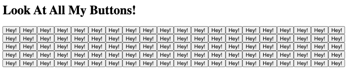

# 100 Button Insanity Exercise

Without touching `index.html`, please use JavaScript to **create exactly 100 new button elements!** Add each new button inside the container element provided in index.html. Here are the steps:

-   Create exactly 100 new button elements

-   Each button must have some text inside of it (it doesn't matter what)

-   Each button **must be appended inside the container div.**

Hint: Loop 100 times. Inside the loop, create a new empty button element.  Add some innerText to the button.  Then, append the button to the container.